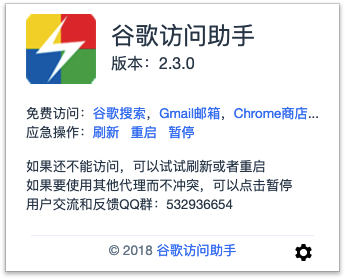
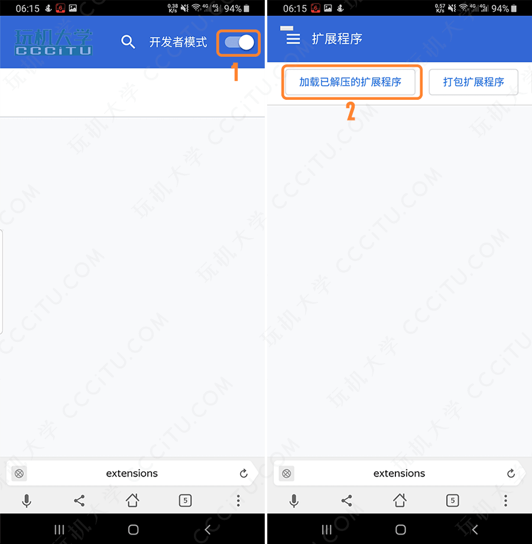
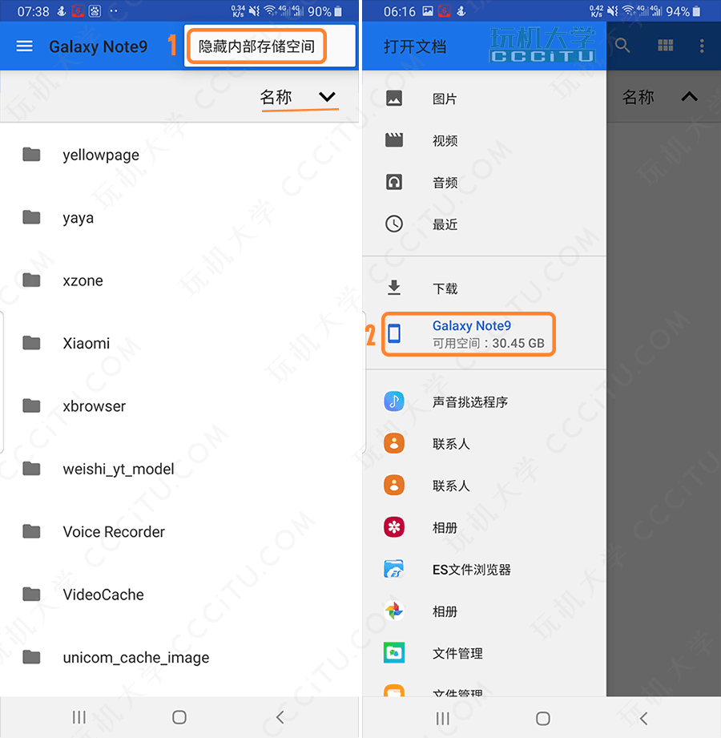
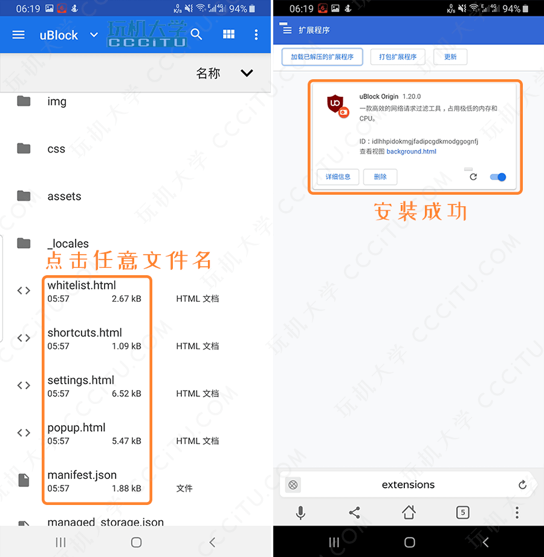
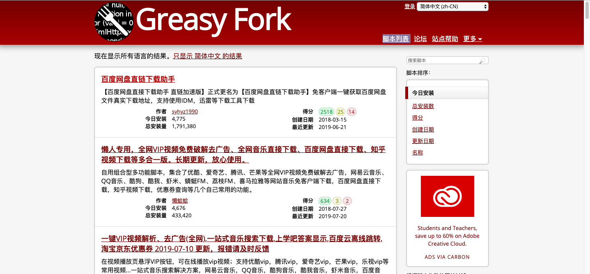
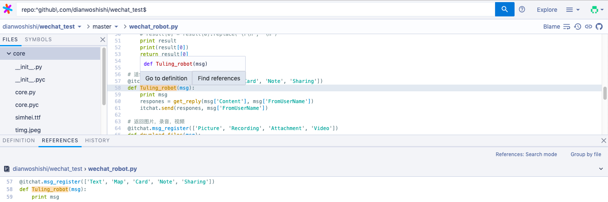
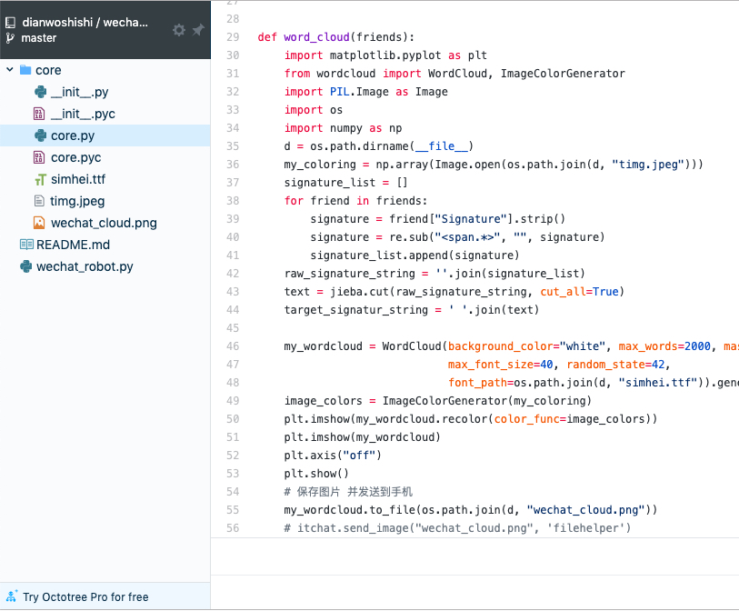

# 浏览器（Android，PC）chrome插件安装指南

首先，安装离线谷歌访问助手。这样在国内就可以无障碍访问谷歌[chrome 网上应用店](https://chrome.google.com/webstore/category/extensions?hl=zh-CN)。

直接离线安装CRX插件会出现错误，

## 0x01 谷歌访问助手（破解版）

使用方法：

1. 解压谷歌访问助手 v2.3.0破解版（google-access-helper-2.3.0.zip [https://github.com/haotian-wang/google-access-helper]）
2. 打开谷歌浏览器；或者地址栏复制红色部分打开（chrome://extensions）
3. 或者 右上角-更多工具-扩展程序
4. 在打开界面的右上角，打开开发者模式
5. 然后左上角出现“加载已解压的扩展程序”，点击，找到刚才解压出的“google-access-helper-2.3.0”文件夹，选择此文件夹，即可安装成功
6. 重启谷歌浏览器，右上角出现谷歌助手的图标既安装成功。就可以使用谷歌应用商店了。

## 0x02 手机浏览器安装Chrome插件

### Yandex浏览器

Yandex Browser 是一个由俄罗斯网络搜索公司 Yandex 开发的基于 Chromium 之免费网页浏览器，使用 Blink 排版引擎，现在可以运行在 Windows、OS X、Android 和 iOS 等平台。

Yandex`是为数不多可以安装Chrome扩展插件的`手机浏览器`，这源于Yandex采用了`Chromeium`内核。手机版Yandex能够直接在Chrome应用店在线安装插件

下载地址：https://play.google.com/store/apps/details?id=com.yandex.browser&referrer=promopage

手机安装，方法类似于PC端浏览器。参考：https://www.cccitu.com/982.html

部分步骤如下所示：

打开Yandex浏览器，在地址栏输入`Chrome://extensions/`打开，放大页面，启用右上角的`开发者选项`，然后点击左上角的`加载已解压的扩展程序`

点击**右上角三个点**，选择`显示内部储存空间`，然后点击**左上角菜单图标**，打开`下载`选项下方的`手机存储空间`（这里一定要注意，必须通过这个方式找到解压后的压缩包，否则会提示缺少文件）

点击右上角选择按照`名称`排序，找到存放`解压后的插件文件夹`（图例为uBlock），打开文件夹，点击`任意文件名`即可安装。

## 0x03 Chrome插件集合

### 0x03.01 Tampermonkey

Chrome商店：[油猴脚本](https://chrome.google.com/webstore/detail/tampermonkey/dhdgffkkebhmkfjojejmpbldmpobfkfo)

Tampermonkey（油猴脚本）是一款免费的浏览器扩展和最为流行的用户脚本管理器，它适用于 Chrome, Microsoft Edge, Safari, Opera Next, 和 Firefox。 虽然有些受支持的浏览器拥有原生的用户脚本支持，但 Tampermonkey（油猴脚本）将在您的用户脚本管理方面提供更多的便利。 它提供了诸如便捷脚本安装、自动更新检查、标签中的脚本运行状况速览、内置的编辑器等众多功能， 同时Tampermonkey还有可能正常运行原本并不兼容的脚本。

脚本地址：[脚本列表](https://greasyfork.org/zh-CN/scripts)，如下所示

### 0x03.02 Sourcegraph - 浏览和搜索Github

Chrome商店：[Sourcegraph](https://chrome.google.com/webstore/detail/sourcegraph/dgjhfomjieaadpoljlnidmbgkdffpack?hl=zh-CN)

Sourcegraph 是一款能够根据语义来把Web上的开源代码编入索引的代码搜索浏览工具。你可以从代码仓库和安装包甚至是函数里搜索代码，同时也可以直接点击被完全创建了链接的代码来阅读文档、跳转到变量定义或者马上找到可用的Demo。总而言之，你可以在你的web浏览器上完成这一切，而不需要配置任何编辑器。由Sourcegraph 出品的这款Chrome插件，可以非常方便的浏览和搜索Github上的代码，持跨repository搜索、跳转到定义、查找引用等功能，宛若一个功能强大的IDE。核心功能如跳转到定义(Go-to-definition)——浏览文件或查看pull请求时，将鼠标悬停在代码上可以查看文档提示，单击即可跳转到定义、查找引用或全文搜索。

示例：

### 0x03.03 Octotree

Chrome商店：[Octotree](https://chrome.google.com/webstore/detail/octotree/bkhaagjahfmjljalopjnoealnfndnagc)

Octotree 是国外程序员Buu Nguyen 做的一个 [Chrome 插件](https://chrome.google.com/webstore/detail/octotree/bkhaagjahfmjljalopjnoealnfndnagc)。安装之后，浏览托管在Github上的项目，可看到左侧的树形结构，更方便查看代码…… （有点 IDE 的感觉，用着好来点个赞吧）

特性：

- 像 IDE 那样方便地浏览代码
- pjax 支持快速浏览
- 支持热键切换代码树
- 支持私有仓库 [1]

示例：

